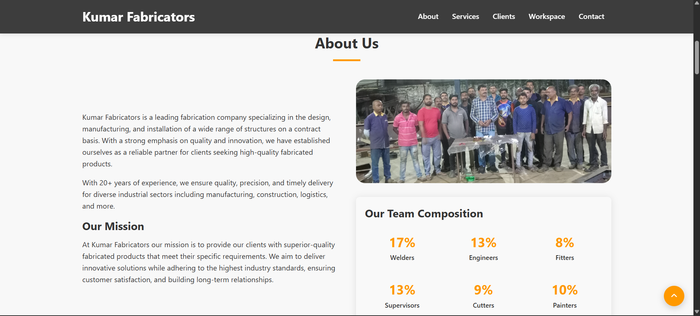
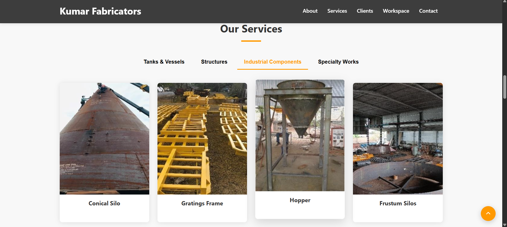
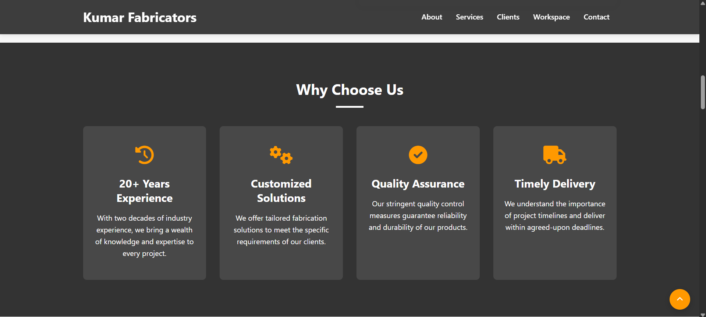
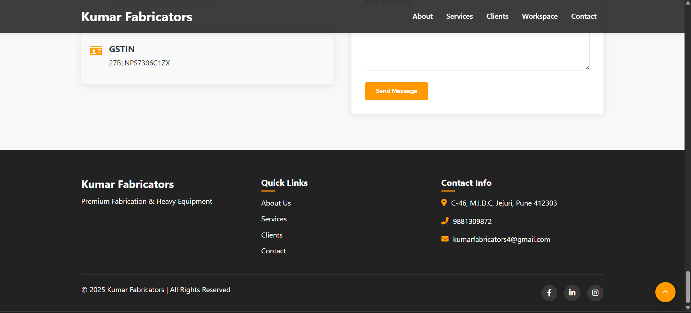

# Kumar Fabricators Website

A fully responsive and interactive website designed for **Kumar Fabricators**, showcasing their heavy equipment fabrication services. Built for professional presentation to recruiters, clients, and industrial stakeholders.

---

## 🌐 Live Demo

> You can deploy this project on **GitHub Pages**, **Netlify**, or **Vercel** for easy access.

---

## 📸 Screenshots

### 🔥 Hero Section


### 🧑‍🏭 About Section with Team Stats



### 🛠️ Services 



### 🏢 Why Choose Us



### 📞 Contact Form


### 📞 Footer



---

## 🧰 Technologies Used

- **HTML5** – Semantic and accessible markup  
- **CSS3** – Modern styles with Flexbox, Grid, and animations  
- **JavaScript (Vanilla)** – Dynamic tabs, gallery, form validation  
- **Font Awesome** – Icons  
- **Google Fonts** – Elegant typography using Poppins  

---

## 📁 Project Structure

/📁 project-root
│
├── index.html # Main landing page
├── style.css # All styles and responsive layout
├── script.js # Interactivity and animations
├── /images # Team, services, and client images
├── /videos # Background video file
└── /screenshots # Screenshot images for README

yaml
Copy
Edit

---

## 🚀 Getting Started

To run this project locally:

```bash
git clone https://github.com/your-username/kumar-fabricators.git
cd kumar-fabricators
open index.html # Or use Live Server in VS Code
Or just drag and drop the index.html file in your browser.

✨ Features
🎥 Fullscreen video hero section

🔁 Animated sections on scroll

📱 Fully responsive layout

🧭 Navigation with smooth scroll

💬 Contact form with validation

🔁 Client logo carousel

📦 Deployment
You can deploy the site using:

GitHub Pages

Netlify (Recommended)

Vercel

👨‍💻 Developed By
Sachin Singh

Designed with modern web standards in mind to appeal to recruiters and enterprise clients.

